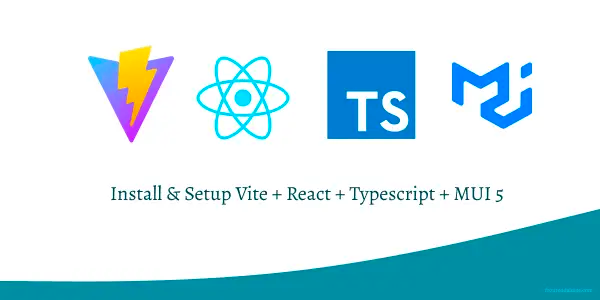

# Project Setup with Vite, TypeScript, Material-UI, Prettier, ESLint, and Jest



This guide will help you set up a React project with Vite, TypeScript, Material-UI, Prettier, ESLint, and Jest.

## Prerequisites

Make sure you have Node.js and npm installed on your system.

## Steps

1. Install Vite globally:
   ```bash
   npm install -g create-vite
   ```
2. Create a new Vite project using the React TypeScript template:
    ```bash
    create-vite my-project --template react-ts
    cd my-project    
    ```
3. Install Material-UI and its dependencies:
    ```bash 
    npm install @mui/material @emotion/react @emotion/styled @mui/icons-material
    ```
4. Follow the Material-UI setup instructions to configure your project with a custom theme and other configurations.
5. Install Prettier and ESLint:
    ```bash
   npm install --save-dev eslint prettier eslint-plugin-prettier eslint-config-prettier eslint-plugin-react @typescript-eslint/eslint-plugin @typescript-eslint/parser
   ```
6. Create an .eslintrc.cjs configuration file at the root of the project:
    ```
   module.exports = {
    parser: "@typescript-eslint/parser",
    extends: [
        "plugin:react/recommended",
        "plugin:@typescript-eslint/recommended",
        "prettier",
    ],
    plugins: ["@typescript-eslint", "react", "prettier"],
    rules: {
        "prettier/prettier": "error",
        "react/react-in-jsx-scope": "off",
    },
    settings: {
        react: {
            version: "detect",
        },
    },
    };
   ```

7. Create a .prettierrc configuration file at the root of the project:
    ```json
    {
        "semi": true,
        "trailingComma": "all",
        "singleQuote": true,
        "printWidth": 80,
        "tabWidth": 2
    }
    ```
8. Add a script in the package.json file to run ESLint and Prettier:
   ```
    "scripts": {
    "lint": "eslint --config .eslintrc.json --ext .js,.jsx,.ts,.tsx src",
    "lint:fix": "eslint --config .eslintrc.json --ext .js,.jsx,.ts,.tsx src --fix"
    }
   ```
9. Install Jest and its dependencies:
    ```bash
    npm install --save-dev jest ts-jest @types/jest jest-environment-jsdom
   ```
10. Create a jest.config.cjs configuration file at the root of the project:
    ```
    module.exports = {
        preset: "ts-jest",
        testEnvironment: "jsdom",
        moduleNameMapper: {
        "\\.(css|less|scss|sass)$": "identity-obj-proxy",
        },
        setupFilesAfterEnv: ["<rootDir>/src/setupTests.ts"],
    };
    ```
11. Create a setupTests.ts configuration file in the src directory:
    ```typescript
    import "@testing-library/jest-dom";
    ```
12.  Add a script in the package.json file to run Jest (tests):
   ```
    "scripts": {
    "test": "jest --config jest.config.cjs"
    }
   ```